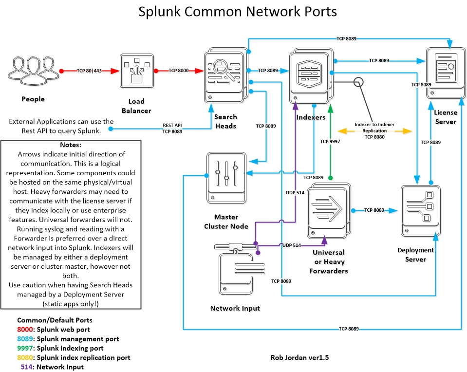

# Install a Splunk Search Head - Deployment Server - Indexers

### Contents
[TOC]
## Installing Splunk Enterprise on Linux

### Obtain the Splunk installation package

* Access the Splunk website:
<a href="https://www.splunk.com/en_us/download/sem.html?ac=ga_usa_brand_enterprise_exact_Mar17&_kk=splunk%2520enterprise&gclid=CIvWzN6Hk9MCFQsRgQodK_QARg" target="_blank">Download Splunk Enterprise RPM for Linux-x86_64</a>

__Note: You will have to create or login using your Splunk user ID & password.  __

* Select and download the appropriate rpm package (...x86_64.rpm)
* Use ftp or WinSCP to copy the package to the splunk server.  
* Change permissions on the file:
previous:  
```-rw-------. 1 baxtj018 admin 226438185 Apr  7 15:13 splunk-6.5.3-36937ad027d4-linux-2.6-x86_64.rpm```

	```chmod 744 splunk-6.5.3-36937ad027d4-linux-2.6-x86_64.rpm```

### Installing the Splunk package

```sudo rpm -i splunk-6.5.1-f74036626f0c-linux-2.6-x86_64.rpm  ```

You may see:  
warning: splunk-6.5.3-36937ad027d4-linux-2.6-x86_64.rpm: Header V4 DSA/SHA1 Signature, key ID 653fb112: NOKEY  
then:  
complete  

* Start splunk:
	```
	sudo su
	cd /opt/splunk/bin  
	./splunk start  
	```  
    
* Space-down and answer 'y' to the license question, or use:  

```./splunk start --accept-license```

You'll see a series of startup messages, then:  

```The Splunk web interface is at http://<yourservername>:8000```

### Logging into Splunk Enterprise - First Time 

* Login to Splunk Web: ```http://<yourservername>:8000/```
```
user: admin
password: changeme
(this is the default password upon a new installation)

New password: MyNewPassword
```
You may see a 'Help us improve Splunk software' message...  

* un-check the 'Share license usage data with Splunk' box  and click 'OK'  

### Post Installation Settings

These are recommended settings to ensure that Splunk starts automatically after a server reboot, set the default environment variable, and 

__Note: all splunk commands are run from /opt/splunk/bin__

* Configure linux to start Splunk on boot:

```./splunk enable boot-start```  

You'll get messages:  
Init script installed at /etc/init.d/splunk.
Init script is configured to run at boot.

The enable boot-start exercise above creates a 'splunk' start-up script file in /etc/rc.d/init.d

#### Disable Transparent Huge Pages

The /etc/rc.d/init.d file should be edited to add functions to disable Transparent Huge Pages on some linux distros such as Red Hat.

<a href="https://github.com/packetiq/SplunkArchitect/blob/master/DisableTransparentHugePages.md" target="_blank">Instructions</a>

#### Set the environment variable for $SPLUNK_HOME

Append this to the bottom of /etc/profile file:

```export SPLUNK_HOME="/opt/splunk"```

and run this command from the command line as well to create the variable in the current session.  

You can now do

```$SPLUNK_HOME/bin/<command>```
or
```cd $SPLUNK_HOME```

#### Change the default Splunk Web port from 8000 to 8080 (Optional)

For an initial test scenario, you may want to use non-SSL access, on a non-standard port. __See the next section to configure a different port and/or use SSL__

```/opt/splunk/bin/splunk set web-port 8080```

This adds the following to opt/splunk/etc/system/local/web.conf

	[settings]
	httpport = 8080  


### Configure Splunk Web to use SSL (Recommended)

From Splunk Web:

Settings > Server settings > General settings 
Splunk Web

Run Splunk Web: Yes (on by default)
Enable SSL (HTTPS) in Splunk Web?: Yes
Web port: 8443
Click Save
This will modify /opt/splunk/etc/system/local/web.conf to contain:
```
[settings]
httpport = 8443
enableSplunkWebSSL = true
```

__You are now ready to customize this instance of Splunk Enterprise for a specific function__

[top](#Contents)

## Create a Splunk Search Head

[top](#Contents)

## Create a Splunk Indexer 
[top](#Contents)

## Create a Deployment Server

[top](#Contents)

## Install a Universal Forwarder

[top](#Contents)

## Splunk Common Network Ports

  

> Written with [StackEdit](https://stackedit.io/).